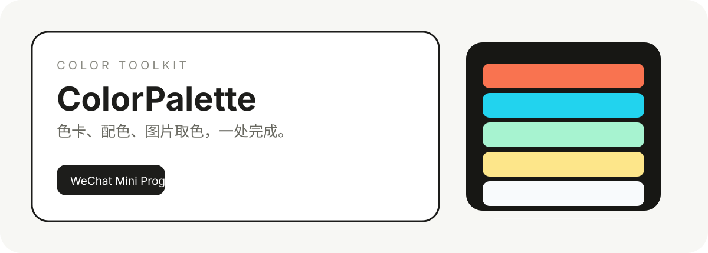
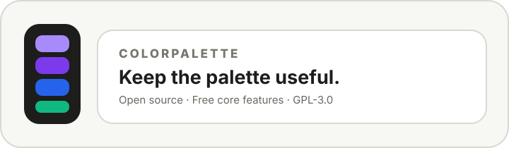

<div align="center">
  <picture>
    <source media="(prefers-color-scheme: dark)" srcset="assets/readme/hero-dark.svg">
    <source media="(prefers-color-scheme: light)" srcset="assets/readme/hero.svg">
    
  </picture>
</div>

<div align="center">

# ColorPalette

**A local-first color workspace for extracting, understanding, relating, and creating colors.**

[](LICENSE)
[](https://pages.github.com/)
[](https://developer.mozilla.org/docs/Web/JavaScript)

[Live site](https://cyojkoy.github.io/ColorPalette/) · [Source](https://github.com/CYoJkoY/ColorPalette) · [Support](https://cyojkoy.github.io/Payment/)

</div>

> **Find a color → understand its relationships → build a palette → save it locally.**

ColorPalette is a static, browser-first application for practical color work. Image sampling, named-color exploration, color analysis, palette generation, favorites, recent colors, and workspace storage all run locally in the browser.

## What it does

| Workflow | Purpose |
| :--- | :--- |
| **Extract** | Read representative colors from a local image. |
| **Explore** | Search a curated library of 492 named colors. |
| **Analyze** | Inspect HEX, RGB, HSL, OKLab/OKLCH, contrast, and relationships. |
| **Create** | Generate, edit, reorder, save, and export palettes. |
| **Keep** | Store palettes, favorites, and recent colors in browser `localStorage`. |

No account or application server is required for the core workflows.

## Named color library

The dataset contains **492 named colors** across five collections:

- Basic colors
- CSS standard colors
- Traditional Chinese colors
- Traditional Japanese colors
- Art and pigment references

Historical and cultural HEX values are digital reference values; they are not claims of one physically exact pigment standard.

## Image extraction

The Extract workflow uses the browser File API and Canvas API. Local images are processed in memory and are not uploaded to an application backend.

## Palette Studio

Palette Studio provides HEX/HSL controls, 15 palette relationships, manual swatch editing, local persistence, and CSS/JSON export.

## Local workspace

Saved palettes, favorites, and recent colors are stored in browser `localStorage`. Clearing the site's browser data removes this local workspace.

## Architecture

```text
Repository
├── web/                 # Static browser application and Pages output
│   ├── index.html
│   ├── app-locale.js    # Application rendering and routing
│   ├── ui-shell.js      # Shell/navigation and metadata
│   ├── preferences-lite.js
│   ├── i18n.js
│   ├── locales/         # zh-CN / en-US locale resources
│   └── build-data.js    # Generates browser color data
├── core/                # Framework-free color algorithms and color library
├── tests/               # Node.js algorithm tests
├── assets/readme/       # README artwork and support graphics
├── docs/
└── .github/workflows/   # Quality gates and GitHub Pages deployment
```

The web application is locale-first: `zh-CN.js` and `en-US.js` provide semantic keys, `i18n.js` resolves the active locale, and the UI renderer consumes those keys directly. There is no DOM translation pass.

## Development

The project intentionally has no frontend framework and no package-manager requirement for the web application.

```bash
node web/build-data.js
python -m http.server 8000 --directory web
```

Open `http://localhost:8000/` in a browser. Serve through HTTP because the color data is loaded with `fetch()`.

Run the algorithm tests with:

```bash
node tests/color.test.js
```

GitHub Actions also checks locale parity, generated browser data, JavaScript syntax, and required assets.

## Deployment

GitHub Pages is deployed automatically from `main` through `.github/workflows/pages.yml`.

Public site: **https://cyojkoy.github.io/ColorPalette/**

## Privacy model

- Local images stay in the browser.
- Palettes, favorites, and recent colors stay in `localStorage`.
- No login is required for the core application.
- No server-side color processing is required.

## Support the project

ColorPalette is free to use and its core is open source under GPL-3.0. Support helps fund continued development, maintenance, documentation, and new color workflows.

<div align="center">

<a href="https://cyojkoy.github.io/Payment/">
  <picture>
    <source media="(prefers-color-scheme: dark)" srcset="assets/readme/support-cta.svg">
    <source media="(prefers-color-scheme: light)" srcset="assets/readme/support-cta-light.svg">
    
  </picture>
</a>

**Support page:** https://cyojkoy.github.io/Payment/

</div>

## License

ColorPalette is released under the **GNU General Public License v3.0**. See [`LICENSE`](LICENSE) for the complete license text.

<div align="center">

**ColorPalette — find a color, understand it, and turn it into something useful.**

</div>
