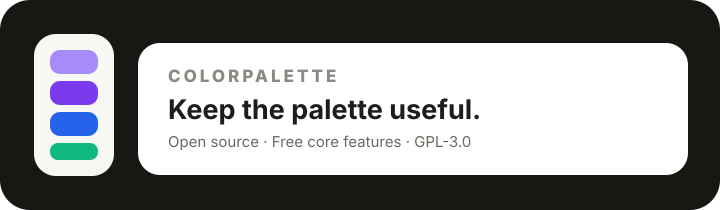

<div align="center">
  
</div>

<div align="center">

# ColorPalette

**一款真正用于“找颜色、做颜色、保存颜色”的微信小程序。**

从图片取色、颜色库，到配色生成、HSL 微调、OKLab 色阶与自制色卡，ColorPalette 把常用的色彩工作流压缩进一个轻量的原生微信小程序。

[](LICENSE)
[](https://developers.weixin.qq.com/miniprogram/dev/framework/)
[](https://developer.mozilla.org/docs/Web/JavaScript)

</div>

<div align="center">

**设计师** · **前端开发者** · **游戏开发者** · **UI/UX 创作者**

</div>

##  核心工作流

ColorPalette 不只是一个色卡展示页。它把实际创作拆成三个连续动作：

```text
                 ┌──────────────┐
                 │     取色     │
                 │ 图片 / 主色板 │
                 └──────┬───────┘
                        ↓
                 ┌──────────────┐
                 │     创作     │
                 │ 基础色 / 色库 │
                 │ 配色 / HSL   │
                 └──────┬───────┘
                        ↓
                 ┌──────────────┐
                 │     收藏     │
                 │   我的色卡库  │
                 └──────────────┘
```

正常使用不会被广告打断。广告只作为用户主动兑换临时 Pro 权益的可选入口，不参与取色、创作、复制、收藏等基础操作。

##  现在可以做什么？

| 能力 | 状态 | 说明 |
| :--- | :---: | :--- |
| 图片取色 | ✅ | 上传图片并点击画面中的位置直接取色 |
| 图片主色板 | ✅ | 本地采样并提取最多 12 个代表色 |
| 精选色卡 | ✅ | Aurora / Forest / Sunset / Ocean / Lavender / Citrus / Rose 等 |
| 60 色颜色库 | ✅ | 红、橙、黄、绿、青、蓝、紫、粉、棕、中性 10 类 |
| 自制色卡 | ✅ | 基础色 + HSL 调整 + 颜色库 + 手动加入颜色 |
| 配色生成 | ✅ | 15 种配色 / 色阶模式 |
| HEX / RGB / HSL | ✅ | 解析、转换、验证 |
| OKLab 色阶 | ✅ | 9 阶感知亮度色阶 |
| 本地收藏 | ✅ | 色卡保存于微信本地存储 |
| 色卡分享 | ✅ | 复制 HEX 色卡文本 |
| Pro | ✅ | 月卡 / 年卡 + 激励广告临时权益模型 |
| 激励广告 | 🧩 | 仅主动兑换时展示，不影响正常使用 |
| 微信支付 | 🧩 | 已预留可信后端订单边界 |
| 云同步 | 🗓️ | 后续版本加入 |

##  丰富的配色系统

ColorPalette 不再局限于四种基础和谐关系。

###  关系型配色

- 类似色
- 互补色
- 分裂互补
- 三角色
- 四角色
- 方形配色
- 双互补

###  明度与质感

- 单色阶
- 浅色阶
- 深色阶
- 柔和色阶
- 粉彩
- 鲜艳
- 暖色
- 冷色
- 灰阶

因此一个基础色可以快速衍生出一整套用于 UI、插画、游戏素材或网页设计的颜色体系，而不是只得到两三个关系色。

##  图片取色：不只是“提取主色”

图片取色现在有两条路径：

**自动取色**：上传图片 → 缩略采样 → RGB 量化 → 频率排序 → 得到最多 12 个代表色。

**手动取色**：上传图片 → 点击图片中的具体位置 → 获得该位置的颜色 → 自动复制 HEX。

手动取色尤其适合从游戏截图、UI 截图、插画、网页参考图中直接获取某个指定颜色。

目前算法优先保证微信小程序端的速度和稳定性；后续会继续升级到 Lab / OKLab 聚类、空间权重和更稳定的代表色选择。

##  Palette Studio：真正自己做一张色卡

“创作”页面是 ColorPalette 的核心工作区。

```text
选择基础色
   │
   ├── 输入 HEX
   ├── 颜色库选择
   └── 图片取色后继续编辑
          ↓
      HSL 微调
   ┌──────┼──────┐
   色相  饱和度  明度
          ↓
     选择配色模式
          ↓
   生成 5 色基础方案
          ↓
   手动加入当前颜色
          ↓
       最多 8 色
          ↓
       收藏色卡
```

颜色库目前包含 **60 个精选颜色**，按红、橙、黄、绿、青、蓝、紫、粉、棕、中性分类。颜色库不是为了替代自由调色，而是为了减少“我知道想要什么感觉，但不知道从哪个颜色开始”的启动成本。

##  OKLab 与感知色阶

普通 RGB 插值并不等价于人眼感知上的均匀变化。ColorPalette 的高级色阶将颜色转换到 OKLab，主要调整 `L`（Lightness）通道后再转换回 sRGB。

核心实现：

```text
miniprogram/utils/
├── color.js              # HEX / RGB / HSL + 15 类配色生成
├── oklab.js              # RGB ↔ OKLab 与感知距离
├── advanced-palette.js   # OKLab 色阶与颜色去重
└── color-library.js      # 60 个精选颜色 / 10 个色彩类别
```

##  商业化与广告原则

ColorPalette 采用 Free + Pro + Rewarded Ad 模式，但**广告不能成为正常使用的阻碍**。

```text
Free
 │
 ├── 浏览色卡
 ├── 图片取色
 ├── 自制色卡
 ├── 复制颜色
 └── 本地收藏

Pro
 │
 ├── 月卡 / 年卡
 └── 用户主动观看激励广告 → 临时 Pro
```

硬性体验规则：

- 不启动即弹广告。
- 不使用强制插屏打断取色或创作。
- 不把广告伪装成系统下载按钮。
- 不通过虚假按钮诱导误触。
- 不因用户拒绝广告而阻止基础功能。
- 只有用户主动选择兑换 Pro 时才展示激励广告。
- 广告没有完成时不发放奖励。

当前首测方案：

| 方案 | 建议价格 | 权益 |
| :--- | :---: | :--- |
| Free | ¥0 | 核心色彩工作流 |
| Monthly | ¥3.9 / 30 天 | Pro |
| Yearly | ¥19.9 / 365 天 | Pro |
| Rewarded Ad | 免费 | 完整观看一次激励广告 → 24 小时临时 Pro |

正式发布前，广告位、订单创建、支付验证、退款、重复回调幂等和最终权益到账必须由可信后端完成。仓库不包含生产凭据。

##  运行项目

###  环境

- 微信开发者工具
- 自己的微信小程序 AppID
- Node.js 20+（仅用于运行仓库测试）

###  启动

```bash
git clone https://github.com/CYoJkoY/ColorPalette.git
cd ColorPalette
node tests/color.test.js
```

然后使用微信开发者工具打开仓库根目录，将 AppID 配置到 `project.config.json`，编译 `miniprogram/`。

##  项目结构

```text
ColorPalette/
├── miniprogram/
│   ├── pages/
│   │   ├── home/             # 发现 / 精选色卡 / 工作流入口
│   │   ├── palette/          # 色卡详情 / 配色关系 / OKLab
│   │   ├── extractor/        # 图片取色 / 点击取色 / 主色板
│   │   ├── create/           # Palette Studio / 自制色卡
│   │   ├── favorites/        # 本地收藏
│   │   └── pro/              # Pro / 商业化入口
│   ├── services/
│   │   └── monetization.js   # 广告与支付接入边界
│   └── utils/
│       ├── color.js
│       ├── oklab.js
│       ├── advanced-palette.js
│       ├── color-library.js
│       ├── share.js
│       └── storage.js
├── docs/
│   └── MONETIZATION.md
├── tests/
│   └── color.test.js
├── .github/workflows/
│   └── check.yml
├── LICENSE
└── README.md
```

##  质量标准

项目坚持原生微信小程序技术栈，不引入第三方 npm 色彩库。核心颜色算法可以脱离微信运行时使用 Node.js 独立测试。

GitHub Actions 会检查：

- 颜色算法测试；
- 颜色库数量与分类；
- JavaScript 语法；
- 小程序配置 JSON；
- README 必需视觉资源。

每次增加颜色能力时，优先补充算法测试，而不是只验证页面能否打开。

##  Roadmap

###  下一阶段：更专业的色彩分析

- Lab / OKLab 图片聚类
- 空间权重与主体区域检测
- 更稳定的颜色去重与代表色排序
- WCAG 对比度检查
- 色盲模拟
- OKLCH 调色与更精细的色阶控制

###  下一阶段：色卡输出

- 色卡图片生成
- PNG / 文本 / CSS 导出
- 色卡命名
- 收藏搜索与标签
- 从取色结果一键创建色卡

###  下一阶段：云端闭环

- 微信云同步
- 服务端 Pro 权益
- 订单与退款状态同步
- 基础运营数据

##  参与开发

欢迎提交 Issue 和 Pull Request，尤其欢迎新的高质量色卡、色彩算法、图片聚类、无障碍能力和微信小程序兼容性改进。

请不要提交真实生产凭据、支付密钥、API Token 或用户个人数据。

##  License

ColorPalette 使用 **GNU General Public License v3.0**。

对于受到 GPL 条款约束的修改版本和再发布版本，应按照 GPL-3.0 的要求提供对应源代码、许可证文本以及必要的版权与许可声明。

完整许可证见 [`LICENSE`](LICENSE)。

<div align="center">
  
</div>

<div align="center">

**ColorPalette · 把“找颜色”变成“做颜色”。**

</div>
